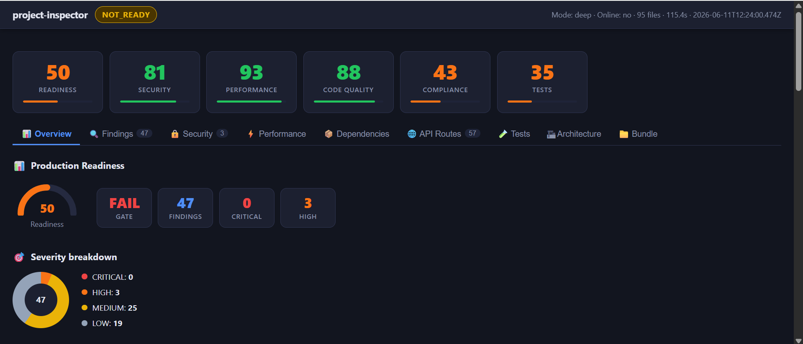
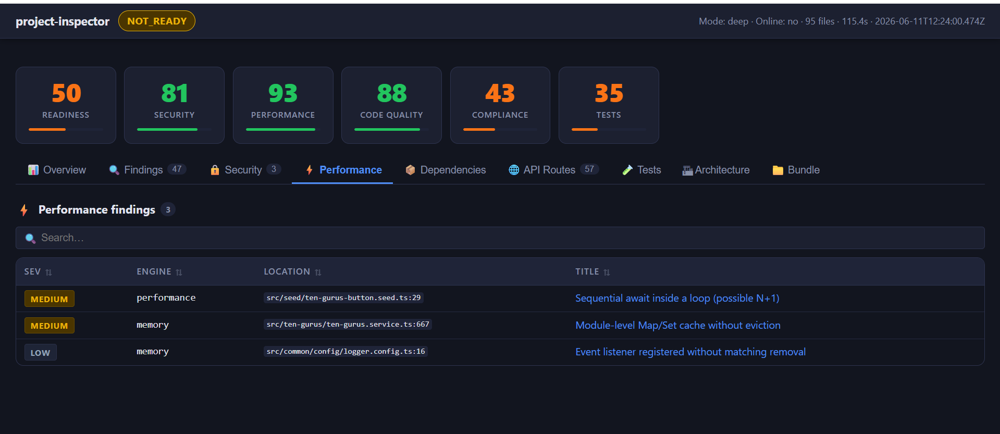
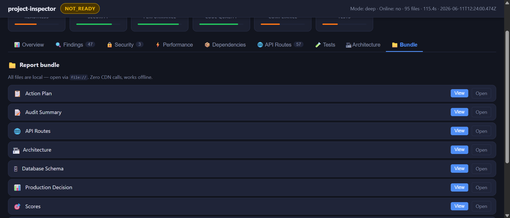

# @vcian/project-inspector

[](https://www.npmjs.com/package/@vcian/project-inspector)
[](LICENSE)
[](https://github.com/vcian/project-inspector/actions/workflows/ci.yml)
[](https://www.npmjs.com/package/@vcian/project-inspector)

**Your code never leaves your machine.** `project-inspector` is a fully offline, deterministic static-analysis CLI — no source upload, no remote server, no LLM, no telemetry. Every scan runs locally and produces identical output for identical input, so it is safe for air-gapped environments, regulated codebases, and CI gates where sending proprietary source to a cloud service is a non-starter.

It scans source code, lockfiles, and project structure to generate production-focused reports for security, architecture, dependencies, API exposure, performance, and release readiness — delivered as a single self-contained interactive HTML dashboard and machine-readable artifacts (`json`, `sarif`).

## Why use this

- Fast local feedback for engineering and AppSec review.
- Stable, deterministic output suitable for CI gates and trend tracking.
- Zero LLM dependency; works in restricted or disconnected environments.
- Produces an interactive HTML dashboard, Markdown reports, and machine-readable artifacts (`json`, `sarif`).
- No CDN dependencies — the HTML report is fully self-contained and works offline.

## How it compares to SonarQube and Semgrep

`project-inspector` is **not** a replacement for SonarQube or Semgrep — it serves a different point in the workflow, and being honest about that matters:

- **vs SonarQube** — SonarQube is a server-hosted quality platform with deep multi-language coverage, historical dashboards, and a rich rule engine, but it requires running (or paying for) a server and pushing your code/metrics into it. `project-inspector` runs as a single offline CLI with zero infrastructure and a self-contained HTML report. Choose SonarQube for org-wide, long-lived quality governance across many languages; choose `project-inspector` for fast, private, infrastructure-free analysis of Node.js/TypeScript projects.
- **vs Semgrep** — Semgrep has a far larger, community-maintained rule registry and a powerful custom pattern language for cross-language taint and dataflow analysis. `project-inspector` ships a focused, curated rule set tuned for the Node.js/TS ecosystem and pairs it with architecture, dependency, API-surface, and database/ER analysis plus a production-readiness verdict in one tool. Choose Semgrep when you need breadth of rules or custom dataflow queries; choose `project-inspector` when you want an opinionated, all-in-one readiness report without writing rules.

In practice these tools are complementary: many teams run `project-inspector` as a fast local/CI gate and keep Semgrep or SonarQube for deeper, language-agnostic coverage.

## Core capabilities

- Static code analysis (AST + rule heuristics).
- Security signals aligned with OWASP-style categorization.
- Dependency and migration risk intelligence (offline + optional `npm audit`).
- API surface discovery (HTTP + CLI command heuristics).
- Performance and memory anti-pattern detection.
- Inventory and project topology mapping.
- Database schema intelligence — ER diagram with entity/relation visualization.
- CI gate verdict via `check`.

## Interactive HTML dashboard

Every scan produces `project-report/index.html` — a single-file, fully offline HTML report.

### Dashboard preview

**Overview** — production-readiness gauge, per-axis scores, and severity breakdown:



**Performance** — engine findings with severity, source location, and title:



**Bundle** — every generated report file, openable locally with zero CDN calls:



> **View a sample report:** the dashboard is generated locally — run `project-inspector scan` in any project and open `project-report/index.html`. Package and source: [npm](https://www.npmjs.com/package/@vcian/project-inspector) · [GitHub](https://github.com/vcian/project-inspector).

The report has the following tabs:

| Tab | Content |
|-----|---------|
| **Issues** | Full findings table with severity badges, filters, owner, fix guidance, and compliance tags |
| **Bundle** | All generated report files with inline Markdown and JSON preview, syntax-highlighted |
| **Architecture** | Data-flow pipeline diagram, framework detection, architecture issues list |
| **Database** | Auto-detected ER diagram (Collections for Mongoose, Tables for SQL/Prisma/TypeORM/Drizzle/Sequelize), relations, indexing hints, schema model cards |

The dashboard requires no server — open it directly in a browser.

## Supported ecosystems

- Node.js / TypeScript / JavaScript
- React / Next.js
- Express / Fastify
- Heuristic NestJS support
- MongoDB / Mongoose (Collection-level ER diagram and relation detection)
- SQL databases via Prisma, TypeORM, Drizzle ORM, Sequelize, or raw `.sql` DDL
- Monorepo and multi-project workspace detection (heuristic)

## Install

### Global install (recommended for CI runners and local CLI use)

```bash
npm install -g @vcian/project-inspector
```

### Verify install

```bash
project-inspector --help
```

## Quick start

```bash
cd your-project
project-inspector scan
```

Default output directory: `./project-report`

Open the report:

```bash
# macOS
open project-report/index.html
# Windows
start project-report/index.html
# Linux
xdg-open project-report/index.html
```

## CLI commands

| Command | Purpose |
|--------|---------|
| `scan` | Run all configured engines and write reports |
| `check` | Run `scan`, evaluate readiness gates, and exit non-zero on failure |
| `watch` | Re-run scans on file changes (debounced, single-flight queue) |
| `chat` | Offline keyword search over previously generated reports (no LLM) |
| `clear` | Remove report directory (including `.cache`) |
| `update-vuln-db` | Refresh optional vulnerability override DB from `VULN_DB_URL` (HTTPS) |

## Command usage

### `scan`

```bash
project-inspector scan [options]
```

| Option | Description |
|--------|-------------|
| `-c, --cwd <path>` | Project root. Default: current working directory |
| `-o, --out <path>` | Output directory. Default: `<cwd>/project-report` |
| `-j, --concurrency <n>` | Parallelism for file-level work (`1-32`; default `max(2, cpuCount - 1)`) |
| `--mode <quick\|deep\|diff>` | Scan strategy. `diff` forces git-changed scope |
| `--online` | Enable online dependency audit (`npm audit`) where supported |
| `--incremental` | Prefer git-changed files |
| `--no-cache` | Ignore cached file hash / merged scan reuse |
| `--rescan` | Force full workspace scan (disable cache + incremental optimization) |
| `--offline` | Disable vuln DB staleness messaging and auto-refresh behavior |
| `--auto-update-db` | Best-effort HTTPS refresh of vuln override DB before dependency engine |
| `--format <md\|json\|sarif>` | Generate extra machine outputs (`results.json` and/or `results.sarif`) |

### `check`

```bash
project-inspector check [options]
```

Same options as `scan`.  
`check` writes `ci-result.json` and exits with code `1` when gate criteria fail.

### `watch`

```bash
project-inspector watch [options]
```

Same options as `scan`. Uses a `1500ms` debounce and single-flight scheduling to prevent overlapping scans.

### `chat`

```bash
project-inspector chat [options]
```

| Option | Description |
|--------|-------------|
| `-c, --cwd <path>` | Root directory used to locate latest reports |

### `clear`

```bash
project-inspector clear [options]
```

| Option | Description |
|--------|-------------|
| `-c, --cwd <path>` | Project root |
| `-o, --out <path>` | Report directory to delete |

### `update-vuln-db`

```bash
project-inspector update-vuln-db [options]
```

| Option | Description |
|--------|-------------|
| `-c, --cwd <path>` | Project root |
| `-o, --out <path>` | Report directory |

## Recommended production workflows

### Local developer loop

```bash
project-inspector scan --mode quick --incremental
```

### Pre-merge validation

```bash
project-inspector check --mode deep --format json --format sarif
```

### Large refactor or branch baseline refresh

```bash
project-inspector scan --rescan --mode deep
```

### Air-gapped / strict offline environment

```bash
project-inspector scan --offline
```

## Output files

Security findings, performance signals, dependency analysis, and hotspots are all embedded inside `audit-summary.md`, `action-plan.md`, and the `index.html` dashboard — there are no separate `security.md` / `performance.md` files.

| Path | Content |
|------|---------|
| `project-report/index.html` | **Interactive HTML dashboard** (Issues, Bundle, Architecture, Database tabs) |
| `project-report/action-plan.md` | Prioritized remediation checklist with owner assignments and ETAs |
| `project-report/audit-summary.md` | GitHub-style Markdown summary for PR comments and job summaries |
| `project-report/api.md` | API surface review — route matrix, auth/validation coverage, endpoint access |
| `project-report/architecture.md` | Architecture analysis, module-to-datastore map, API-to-DB flow, structural issues |
| `project-report/database.md` | Database schema analysis, ER relations, indexing hints, ORM findings |
| `project-report/decision.json` | Machine-readable production verdict and gate status for CI automation |
| `project-report/scores.json` | Numeric scores across all axes plus segment rollup |
| `project-report/openapi.json` | OpenAPI **3.1** export auto-generated from detected HTTP routes |
| `project-report/sbom.cdx.json` | CycloneDX **1.5** SBOM from npm lockfile |
| `project-report/governance-suppressions.json` | Snapshot of active governance suppressions |
| `project-report/results.sarif` | SARIF **2.1.0** report (always written) |
| `project-report/results.json` | Full scan result as JSON — only written with `--format json` |
| `project-report/ci-result.json` | Gate verdict written by the `check` command |
| `project-report/.cache/merged-scan.json` | Cached full scan payload for partial/incremental refresh |
| `project-report/.cache/file-hashes.json` | SHA-256 hash map for incremental file-change detection |
| `project-report/.cache/dependency-snapshot.json` | Dependency and lockfile fingerprint (includes vuln DB hash) |
| `project-report/.cache/scan-meta.json` | Scan metadata and per-engine timing |
| `project-report/.cache/vuln-db-meta.json` | Metadata about the last vuln DB fetch and staleness state |
| `project-report/.cache/env-snapshot.json` | Environment variable key snapshot for drift detection |
| `docs/rules-catalog.md` | Generated rules catalog — run `npm run docs:catalog` to refresh |

## CI integration

### GitHub Actions example

```yaml
name: Static Analysis Gate

on:
  pull_request:
  push:
    branches: [main]

jobs:
  inspect:
    runs-on: ubuntu-latest
    steps:
      - uses: actions/checkout@v4
      - uses: actions/setup-node@v4
        with:
          node-version: '20'
      - run: npm install -g @vcian/project-inspector
      - name: Run production gate
        run: project-inspector check --cwd . --mode deep --format sarif --format json
      - name: Upload SARIF
        if: always()
        uses: github/codeql-action/upload-sarif@v3
        with:
          sarif_file: project-report/results.sarif
```

## Configuration reference

| Key / Flag | Type | Purpose |
|------------|------|---------|
| `LOG_LEVEL` | env | Pino log level (`fatal`, `error`, `warn`, `info`, `debug`, ...) |
| `--mode` | cli | `quick`, `deep`, `diff` |
| `--concurrency` | cli | Control parallelism (`1-32`) |
| `--format` | cli | Additional machine outputs (`json`, `sarif`) |
| `--auto-update-db` | cli | Best-effort refresh using `VULN_DB_URL` before dependency scan |
| `--offline` | cli | Disable remote vuln DB staleness flow and auto-refresh |
| `VULN_DB_URL` | env | HTTPS URL to override vulnerability rule database |
| `policyPack` | `project-inspector.config.json` | Named overlay (`packs/<id>.json`) merging extra ignore globs / suppress substrings (HIPAA, SOC2, PCI, OWASP ASVS samples ship under `packs/`) |

### `VULN_DB_URL` payload shape

```json
{
  "version": "string",
  "updated": "ISO-8601 timestamp",
  "rules": []
}
```

## Reliability and security model

### What this tool is good at

- Deterministic static risk discovery.
- Engineering governance and CI gate standardization.
- Early issue detection before runtime testing.

### What this tool is not

- Not a replacement for penetration testing or dynamic analysis.
- Not full inter-procedural taint analysis.
- Not a complete framework semantic model.

Use findings as high-signal review inputs, then confirm in code review or targeted testing.

## Limitations

- Security engine uses AST + pattern heuristics (no full cross-function data flow).
- `chat` is offline keyword search over local report text, not an AI assistant.
- NestJS route/auth/validation classification is decorator-oriented heuristic analysis.
- Supply-chain insight combines offline rules with optional `npm audit` in `--online` mode.
- Multi-project auto-detection is heuristic when no explicit workspace config exists.
- Mongoose schema detection covers `mongoose.Schema`, `new Schema()`, and `mongoose.model()` patterns; non-standard schema factory wrappers may not be captured.

## Performance and determinism notes

- Caching is enabled by default for speed.
- `--rescan` should be used after major repository churn.
- `--mode diff` and `--incremental` optimize for changed-file workflows.
- Machine output contracts (`decision.json`, `ci-result.json`, `results.sarif`) are suited for automation.

## Development and maintenance

### Local development scripts

| Script | Description |
|--------|-------------|
| `npm run build` | Compile TypeScript to `dist/` (runs build verification post-step) |
| `npm run dev` | Run CLI entry in dev mode using `tsx` |
| `npm run typecheck` | TypeScript strict type check (no emit) |
| `npm run lint` | ESLint with zero warnings |
| `npm test` | Node test runner for all configured test files |
| `npm run test:coverage` | Test suite with lcov + text coverage via `c8` |
| `npm run ci` | Full local CI gate: typecheck + lint + test |
| `npm run clean` | Remove `dist/` directory |
| `npm run refresh-majors` | Refresh curated package major-version metadata (network required) |
| `npm run docs:catalog` | Generate `docs/rules-catalog.md` from engine rule definitions |

### Node version

- Runtime requirement: `node >= 18.0.0`
- Recommended for CI: Node.js `20.x` LTS

## Production adoption checklist

- Run `check` in CI on every PR and protected branch push.
- Upload `results.sarif` to your security platform (GitHub Advanced Security compatible).
- Track `scores.json` and `decision.json` over time for trend baselining.
- Use `--rescan` for release branches and major refactors.
- Keep `VULN_DB_URL` fresh if using private override intelligence.
- Open `project-report/index.html` locally for the full interactive dashboard view.

## Programmatic API

`project-inspector` can also be used as a library in your own scripts or tools.

```ts
import { runScan, writeScanArtifacts, computeScores } from '@vcian/project-inspector';

const result = await runScan({
  cwd: process.cwd(),
  outDir: './project-report',
  mode: 'deep',
});

await writeScanArtifacts(result, './project-report');
console.log(result.scores.productionReadiness);
```

All public exports are documented with JSDoc and ship with TypeScript declaration files (`dist/index.d.ts`). Key exports:

| Export | Description |
|--------|-------------|
| `runScan(options)` | Run a full project scan and return a `ScanResult` |
| `writeScanArtifacts(result, outDir)` | Write all report files (HTML, Markdown, SARIF, SBOM, OpenAPI, JSON) |
| `computeScores(result)` | Compute numeric scores across all analysis axes |
| `buildScoreDiagnostics(result)` | Per-axis hit counts for human-readable explanations |
| `computeHotspots(result)` | Top-10 issues ranked by exploitability heuristic |
| `evaluateCheckGates(result)` | Evaluate a ScanResult against gate thresholds |
| `writeSarifReport(result, outDir)` | Write a SARIF 2.1.0 report only |

## Open-source governance

- Contribution guide: `CONTRIBUTING.md`
- Code of conduct: `CODE_OF_CONDUCT.md`
- Security policy: `SECURITY.md`
- Support guide: `SUPPORT.md`
- Change history: `CHANGELOG.md`
- Release process: `RELEASING.md`

## License

MIT
